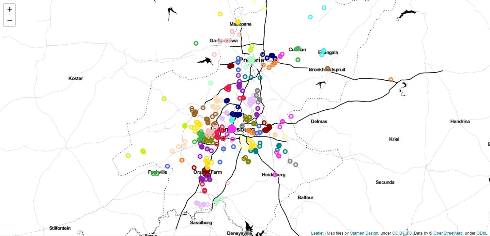

<h1 align='center'> Clustering Geological Data Intelligently with Python</h1>
<h4 align='center'>- Chirag Sable</h4> 

In this project, we will then learn how to visualize geolocation data clearly and interactively using Python. Also, we will learn a simple but limited approach to clustering this data, using the K-Means algorithm. We will develop on this notion of clustering by moving to more advanced density-based methods, namely Density-Based Spatial Clustering of Applications with Noise, known as DBSCAN, and in order to address some of its shortcomings, the more advanced Hierarchical DBSCAN (HDBSCAN). We will also learn about a simple method of addressing outliers that may exist in a clustering problem.

Following python modules/functions have been used in the project:-
1. `matplotlib` for plots and charts visualization of the outcomes.
2. `Pandas` for storing and manipulating data.
3. `Numpy` for its use in data-manipulation.
4. `hdbscan` and `DBSCAN` for spatial-clusterings (hierarchichal).
5. `sklearn` functionalities like `Kmeans` and `silhouette_score` with `KneighboursClassifier`.
6. `Folium` for maps and co-ordinates visualization.

<h2>The Project has been divided into 7-tasks:- </h2>

1. Exploratory Data Analysis
2. Visualizing Geographical Data
3. Clustering Strength / Performance Metric
4. K-Means Clustering
5. DBSCAN
6. HDBSCAN
7. Addressing Outliers

The result is shown below:

